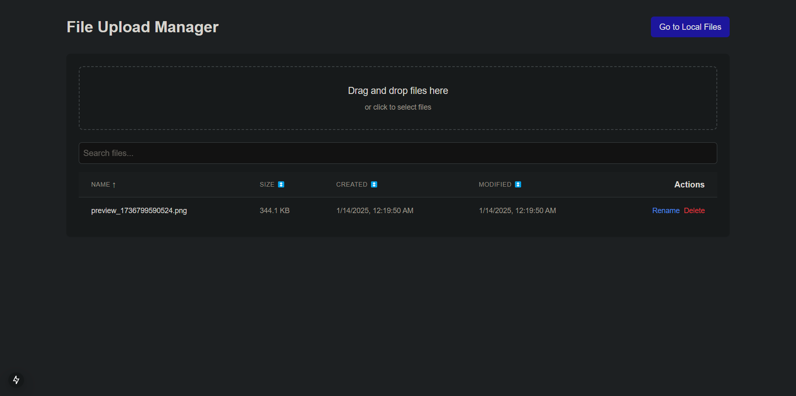
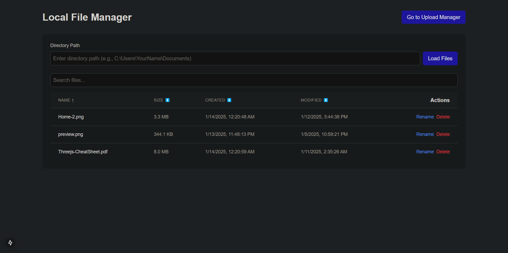

# <p align="center">Simple File Management System</p>


## Preview





### Prerequisites
- Node.js (v14+)
- npm or yarn

### Installation

1. Clone the repository
```bash
git clone https://github.com/yourusername/simple-file-management-system.git
cd simple-file-management-system